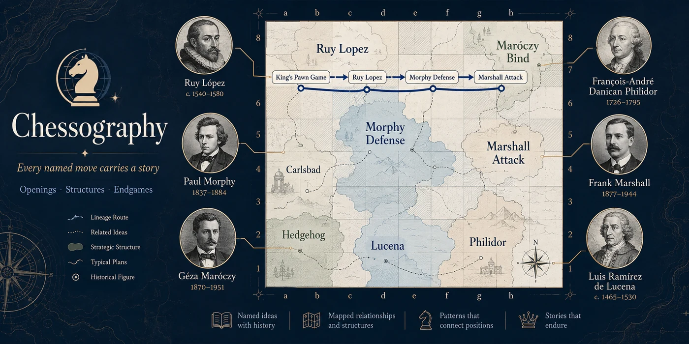

<p align="center">
  <a href="https://chessography.pages.dev">
    
  </a>
</p>

# ♞ Chessography

**[chessography.pages.dev](https://chessography.pages.dev)**

A chess app where every named move carries its story. Play on the board, and
after each move the app resolves the most specific named thing that applies
(an opening line, a pawn structure, or an endgame pattern) and tells you the
story behind that name: the person it honours, where it came from, and how it
earned its place in the game.

Naming is move-level: as a game walks deeper into theory the app shows the
naming lineage (King's Pawn Game → Ruy Lopez → Morphy Defense → Marshall
Attack), so you watch the name narrow with each move.

## The four recognition problems

| Phase | Method |
| --- | --- |
| Openings | Position-keyed lookup (transposition-safe) against the lichess CC0 dataset of 3,732 named lines |
| Middlegame | Pawn-structure detection on board state: IQP, hanging pawns, Carlsbad, Maróczy Bind, Hedgehog, Stonewall |
| Endgame | Material signature + placement: Lucena, Philidor, K+P opposition, wrong rook's pawn, B+N mate |
| Tactics | Named mates from the mated position (smothered, back-rank, Anastasia's, Arabian, Boden's, epaulette) plus the Greek Gift from the move that lands it |

Story content is first-class data (`src/stories/`): 46 opening lines plus all
structures, endgames and tactics have full authored stories (eponym, origin,
narrative, significance, notable games). Named lines without an authored story
still resolve, show their lineage, and inherit the nearest ancestor's story.

## Beyond the board

- **Chronicle your own games** — pull your last 20 games from lichess or
  chess.com (public APIs, no auth) and see each one resolved against the
  atlas, plus your most-visited opening territory.
- **Share links** — the whole game rides in the URL fragment (`#g=…`), so a
  finished chronicle is a link you can send. No backend.
- **Opening trainer** — every storied line is a spaced-repetition card:
  recite it on the board from memory, graded on an SM-2 schedule
  (localStorage).
- **The story atlas** — `npm run build` also generates a static, indexable
  page per story under `dist/atlas/` (plus `sitemap.xml`), each linking back
  into the app via a share link.
- **Offline** — a build-time service worker (`scripts/build-sw.mjs`)
  precaches the app, the engine and the atlas; after one visit the whole
  site works with no connection, installable via the PWA manifest.

## Develop

```bash
npm install
npm run dev        # dev server
npm test           # recognizer test suite (vitest)
npm run build      # regenerates src/data/openings.json, then builds to dist/
```

The opening dataset is rebuilt from `data/*.tsv` (lichess chess-openings,
CC0) by `scripts/build-openings.mjs` on every build.

### AI-drafted stories for the unstoried lines

Named lines without an authored story can get an AI-drafted one via the
Gemini API (the free tier is enough — no card required):

```bash
export GEMINI_API_KEY=...   # free key from https://aistudio.google.com/apikey
node scripts/generate-stories.mjs             # generate (resumes automatically)
node scripts/generate-stories.mjs --dry-run   # just report what remains
```

The script works through the ~3,100 unstoried lines most-inherited-first,
checkpointing to `data/generated-stories.json` after every batch and
re-emitting `src/stories/generated.ts` (the module the app imports), so it
is safe to interrupt at any point or to hit the daily free-tier quota — just
run it again later and it picks up where it stopped. At the default batch
size the whole book fits in about one day of free-tier quota on
`gemini-2.5-flash-lite`.

Drafts are second-class by design: authored stories always win on id
collision, the app labels drafts as AI-written, drafts never carry
`notableGames`/`famousGame`, and the trainer deck and static atlas pages
remain authored-only. Commit the two generated files to ship the drafts.

## Deploy

Pushes to `main` auto-deploy to Cloudflare Pages via GitHub Actions
(`.github/workflows/deploy.yml`). For a manual one-off deploy:

```bash
bash scripts/deploy.sh   # Cloudflare Pages; reads credentials from ~/.secrets
```

## Stack

Vite · React · TypeScript · chess.js · react-chessboard (v5)
